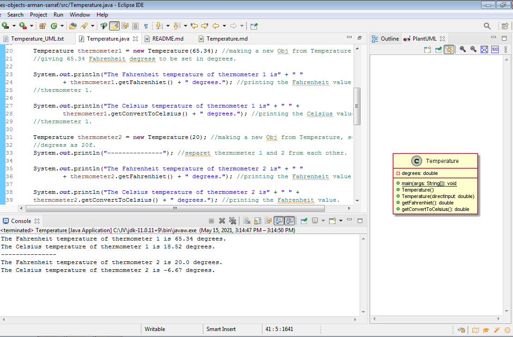

# Temperature report
Author: Arman Sarraf

## UML class diagram

## Specification
Temperature is a class defined to print the temperature in both Fahrenheit and Celsius degree.
The pre-defined degree has been set as Fahrenheit, so the get.Fahrenheit() method just returns
the value, but for counting Celsius degree, the value is converted before being returned by getConvertedCelsius() method.

In this program we have one instance from double which keeps the Fahrenhiet degree, Main()method, two constructors, getFahrenheit(), getConvertToCelsius().

Note: Regarding provided example of output, the value should be printed with two decimals. So Math.round(a*100)/100 has been used in order to get the desired output.

## Execution and Testing

