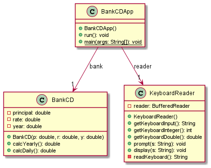
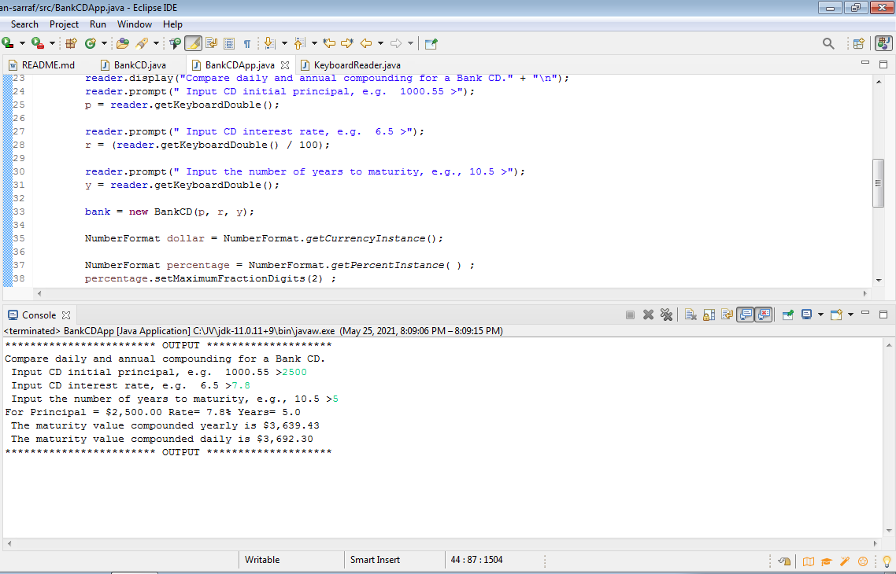

# Days in Month report
Author: Arman Sarraf

*A program has been designed to accumulate interest at a given rate for an initial principal over a fixed number of years and to show it in both yearly and daily compounding.*
## UML class diagram

## Execution and Testing

