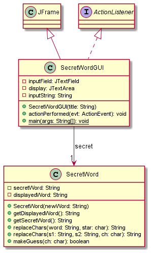
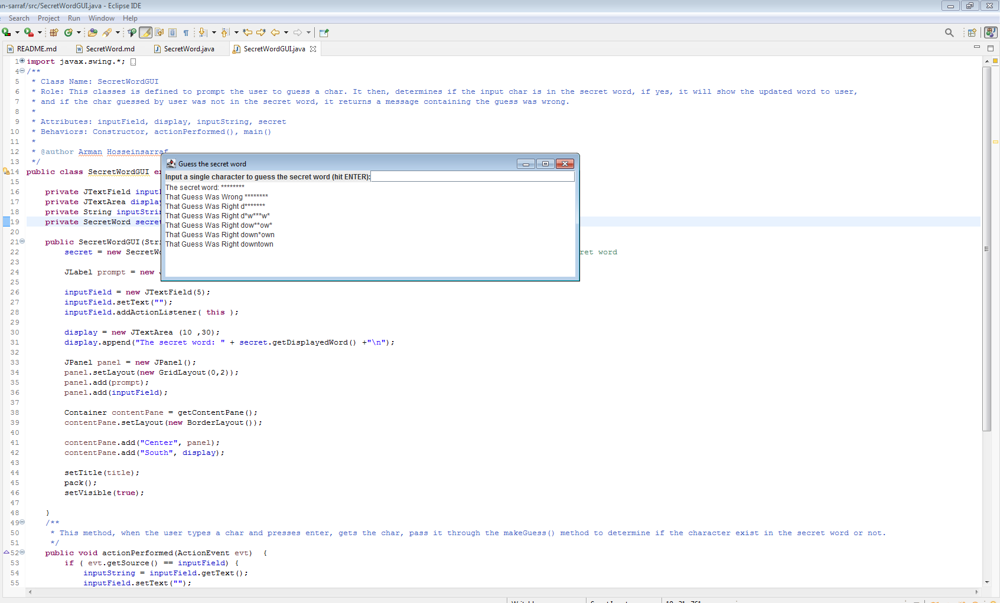

# SecretWord report
Author: Arman Sarraf

*This Program is like a version of Hangman game. We choose a specific word which is hidden from user and they should guess the secret word character by character. We have a secretWord which is our real word, and a displayedWord which is * for the length of our real word.*

## UML class diagram

## Execution and Testing
