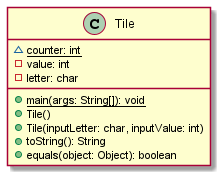
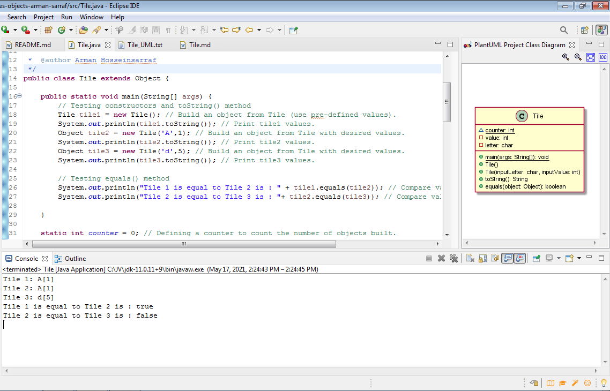

# Tile report
Author: Arman Sarraf

## UML class diagram

## Specification

 * Class Name: Tile 
 *  Role: This program is designed to compare if the value of two objects are equal or not. 
 *  Attributes: We have instance from char which contains the letter, integer instance for keeping the value of the mentioned letter, and counter for counting the number of object being created from tile.
 *  Behaviors: toString(), equals(), main()

## Execution and Testing

