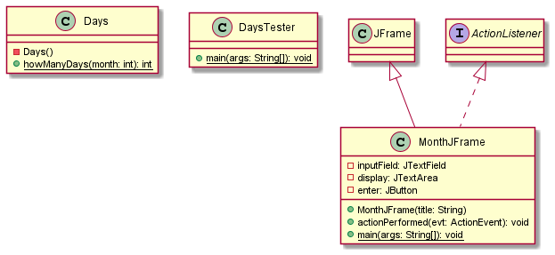
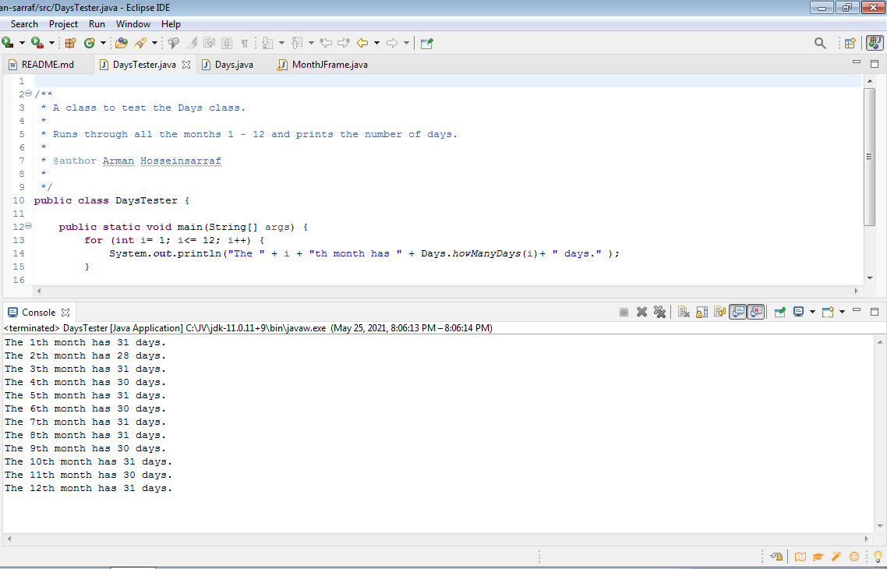
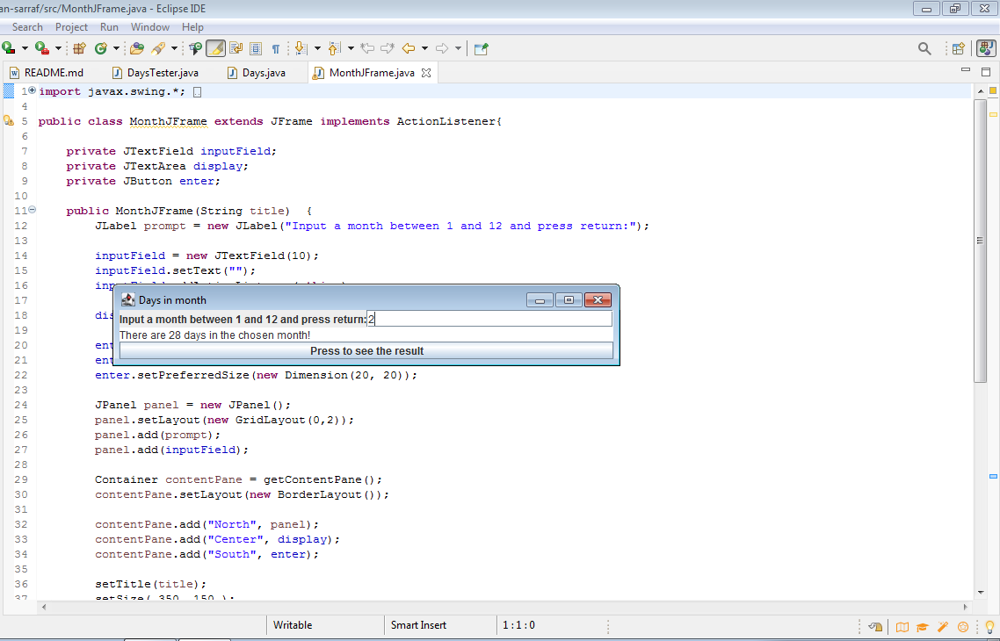

# Days in Month report
Author: Arman Sarraf

*A program has been Implemented as Java graphical user interface that prompts the user to enter a number which represents a month of the year, and reports whether that month contains 28, 30, or 31 days.*
## UML class diagram

## Execution and Testing

