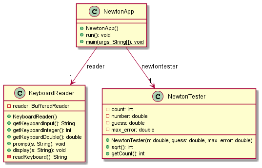

# Newton report
Author: Arman Sarraf

*This program is designed to calculate the root of a number given by user. This program gets number, their guess, and the tolerance from user, and then, calculates the real root from initial guess with the help of Newton method*

## UML class diagram

## Execution and Testing

**Explanation**
*I chose number 25 with the guess of 5 which is the real root of my number. so the number of iterations should be just 1. As shown in the screenshot above, we got the right result.*

**Explanation**
*The root of the number 2 is a famous number. So with testing the program with number 2, guess 2, and the maximum tolerance value, we see 4 iteration is required to reach to the root.*

**Explanation**
*I chose number 1771561 which is 11^6. The real root of the number is 1331 which is 11^3! So, regarding picture above the program works successfully.*